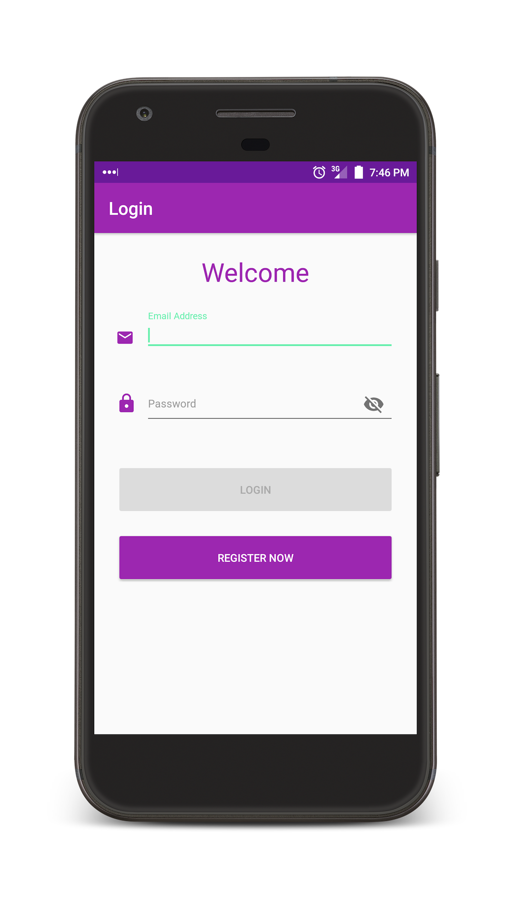
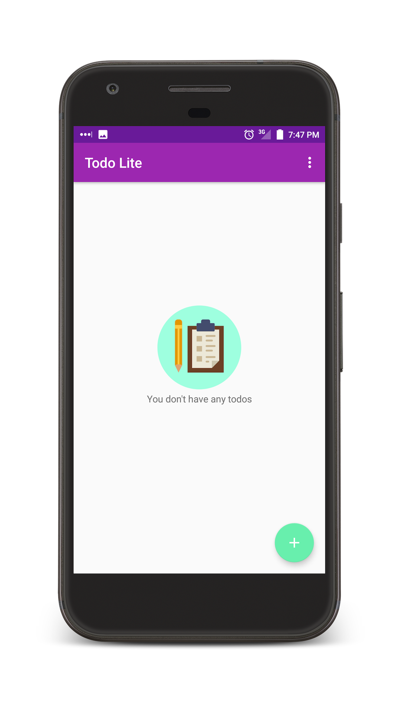

# ToDo Lite Android MVP example 

Todo Lite app, shows the **MVP** pattern usage on Android.

## Screenshots:

## App

- Login/Register 
- Add Task
- Update Task
- Delete/Complete Task by swiping the card left/right
- Set Reminder on the Task. User will be notified by notification.

## Project structure

**data**: Implementation of the Repository pattern, contains all the data accessing. 
**di**: Contains the classes that provide dependencies using Dagger2. 
**ui**: MVP structure, all Activities, Fragments and UI elements in this package. 
**util**: Utility classes. 

## Tools/Libraries

* [Constraint Layout](https://developer.android.com/training/constraint-layout/index.html)
* [Firebase Auth](https://firebase.google.com/docs/auth/)
* [Firebase Database](https://firebase.google.com/docs/database/)
* [Firebase JobDispatcher](https://github.com/firebase/firebase-jobdispatcher-android)
* [RxJava 2](https://github.com/ReactiveX/RxJava)
* [RxAndroid 2](https://github.com/ReactiveX/RxAndroid)
* [RxBindings 2](https://github.com/JakeWharton/RxBinding)
* [ButterKnife](https://github.com/JakeWharton/butterknife)
* [Timber](https://github.com/JakeWharton/timber)
* [Dagger 2](https://github.com/google/dagger)

## Future work

### Todo

- Update form validatoins code.
- Write Unit and instrumentation tests
- Convert the project to kotlin.

